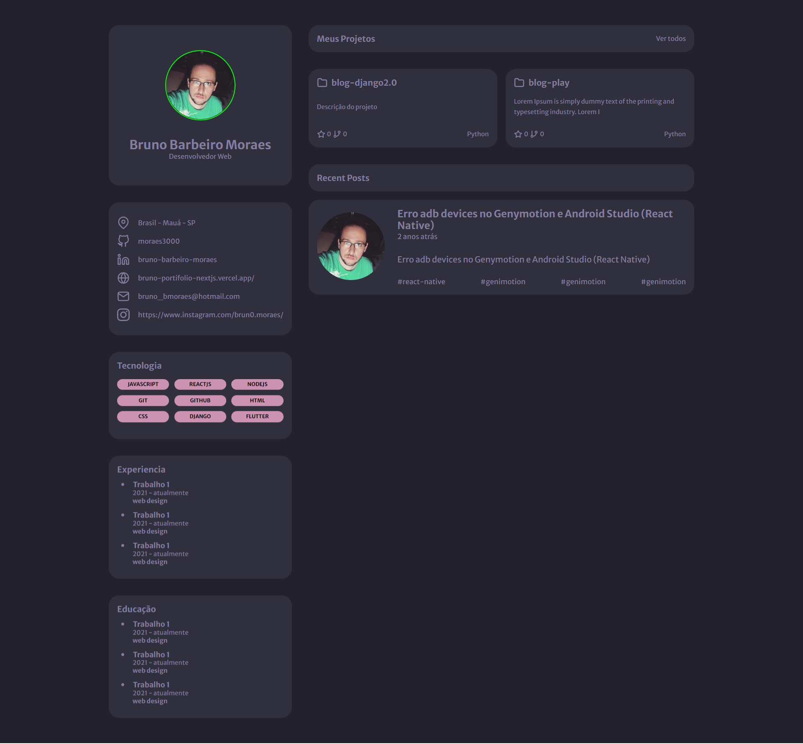

# portifolio-desafio-rocketseat


## Resumo e descrição do projeto

Desafio do Discovery pela empresa Rocketseat.<br/>
Neste desafio você poderá criar uma página web para que seja seu portfolio e currículo. Utilizando HTML e CSS.

## Fotos



Tecnologias

Este projeto foi feito utilizando as seguintes tecnologias:

- [React](https://reactjs.org/)


### Tutorial de instalação

Clone o projeto

```term

git@github.com:moraes3000/portifolio-desafio-rocketseat.git

```

Instale as dependências

```term

yarn

```

Rode o projeto

```term

yarn dev

```

Acesse [http://localhost:3000](http://localhost:3000/) para ver o resultado.